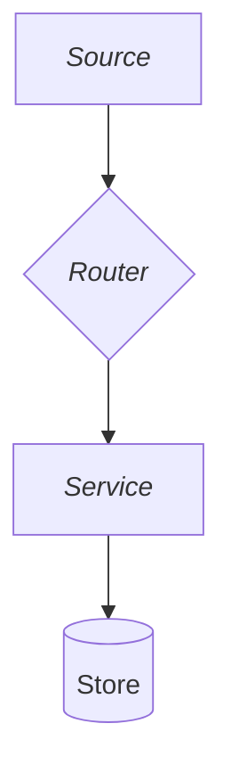

# Design a modular architecture from a spec

## What it does
Takes a generated spec and produces a clean, modular architecture documented in Markdown, including a short explanation and a Mermaid diagram.

## When to use it
Use this skill after a spec exists and before implementation begins. It is useful when the spec describes a feature, API, or component that needs a clear structure.

## Inputs
- The spec file markdown
- Project conventions (language, framework, existing patterns)
- Constraints (scale, team size, maintainability targets)

## Output
- A Markdown architecture document with:
  - A short solution summary
  - Module breakdown
  - Interface contracts
  - A Mermaid diagram
  - Open questions or risks

## Steps

1. **Read the spec**
   - Identify the goal, user flows, data model, and boundaries.

2. **Read existing code**
   - Understand the scope of the fix with the existing architecture.

3. **Extract components**
   - Split the solution into modules or layers.
   - Assign one clear responsibility per component.

4. **Define contracts**
   - List inputs, outputs, and events between components.
   - Keep interfaces narrow and explicit.

5. **Draft the diagram**
   - Use Mermaid to show components and data flow.
   - Avoid overloading the diagram; hide implementation details.

6. **Write the document**
   - Start with the shortest possible summary.
   - Then list components, contracts, and the diagram.
   - End with risks or open decisions.

## Output template

```markdown
# Architecture: <title>

## Summary
<one-paragraph explanation of the approach>

## Components

| Component | Responsibility | Notes |
|-----------|----------------|-------|
| ...       | ...            | ...   |

## Contracts

- `ComponentA -> ComponentB`: <what is passed and when>

## Diagram



## Risks and open questions

- <risk or question>
```

## Rules
- One component, one responsibility.
- Favor plain interfaces over clever abstractions.
- Do not include implementation details in the architecture doc.
- Keep explanations under a few paragraphs.
